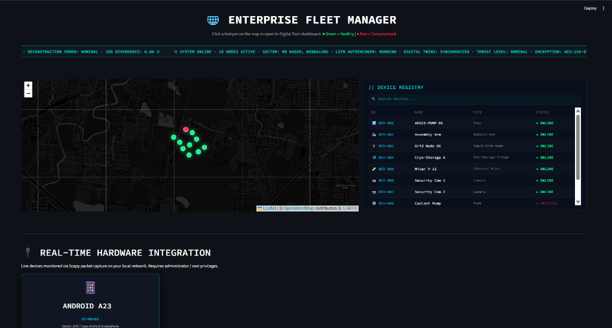
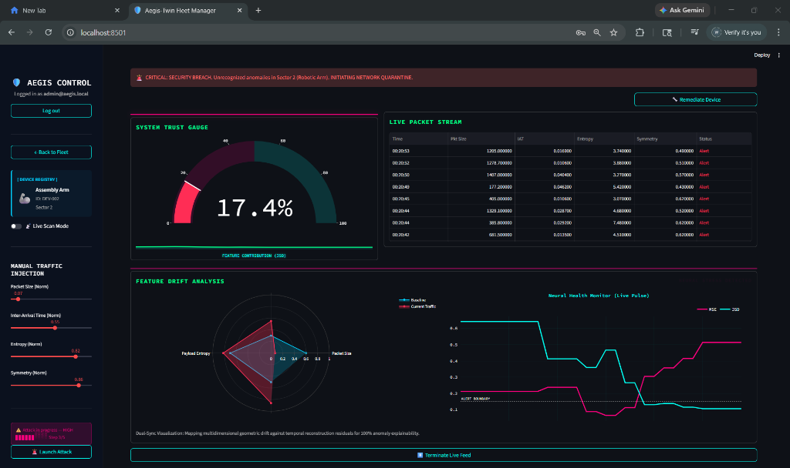
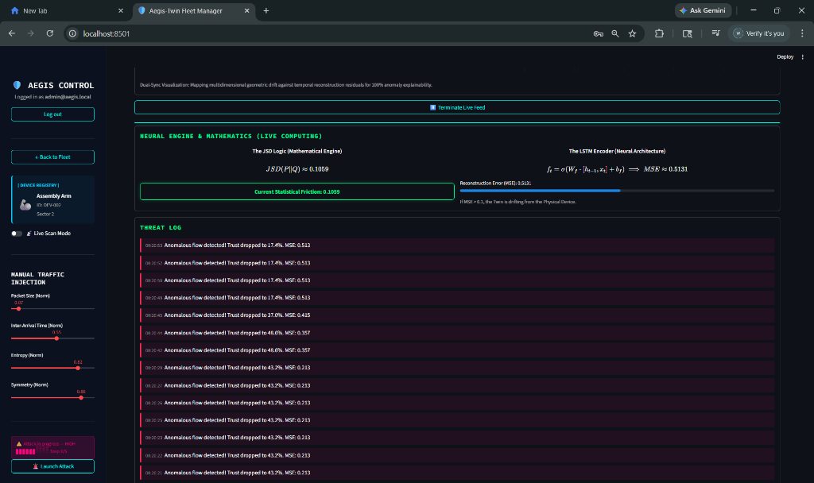

# 🛡️ Aegis-Twin: The Future of Cyber-Physical Resilience

### *Bridging the gap between the physical pulse and the digital fortress.*

---

## 🌩️ The Challenge: A Fragile Frontier
In an era of hyper-connectivity, our critical infrastructure—from smart grids to industrial assembly lines—is under constant siege. Traditional security measures are often "blind" to the subtle, physical-world deviations that precede a catastrophic breach. When a pump vibrates differently or a sensor's heartbeat skips, the digital world often misses the signal until it's too late.

## ✨ The Vision: Aegis-Twin
**Aegis-Twin** is not just a dashboard; it is a **Digital Immune System** for the enterprise fleet. By creating a high-fidelity "Digital Twin" of every physical asset, we synchronize the physical reality with an AI-driven virtual model. If the physical device drifts from its digital ideal, Aegis-Twin knows.

---

## 🌐 The Narrative: A Day in the Life of a Fleet Manager

### 📱 Global Vigilance
Imagine overseeing a fleet of hundreds of IoT nodes across a sprawling metropolis. With the **Geospatial Fleet Manager**, you don't just see dots on a map; you see the live health and connectivity of your entire infrastructure.


*Real-time geospatial synchronization across Sector 1 (RR Nagar, Bengaluru).*

### 🧠 The Neural Pulse
Inside each device, our **LSTM Neural Architecture** is constantly learning. It doesn't just look for "known" attacks; it understands the unique "normality" of your hardware. By monitoring packet symmetry, entropy, and timing, it detects the "unseen" deviations that traditional firewalls ignore.


*Deep-dive into the 'Assembly Arm' twin: 17.4% Trust Score detected via Neural Drift Analysis.*

### 🛡️ Intelligent Remediation
When an anomaly is detected, the **Aegis Engine** doesn't just scream "Alert." It provides a mathematical explanation of the threat through JSD (Jensen-Shannon Divergence) and offers immediate remediation paths to quarantine the unit before the infection spreads.


*Neural Engine tracking mathematical friction and logging real-time anomalous flows.*

---

## 🛠️ The Technology Behind the Shield

We’ve built Aegis-Twin on a foundation of industrial-strength technologies:

- **Neural Architecture**: PyTorch-based LSTM Autoencoders for deep temporal pattern recognition.
- **Forensic Engine**: Scapy-powered live packet inspection and entropy calculation.
- **Dynamic UI**: A high-performance Streamlit interface designed for the mission-critical operations center.
- **Explainable AI**: Mathematical JSD metrics that translate complex AI state into actionable human trust scores.

---

## 🚀 Getting Started

### 1. Mission Briefing (Installation)
```bash
git clone https://github.com/lolaamh06/aegis-twin.git
cd aegis-twin
python -m venv venv
.\venv\Scripts\activate
pip install -r requirements.txt
```

### 2. Deploying the Aegis
```bash
streamlit run app.py
```

---

*Created by the Aegis-Twin Development Team.*
